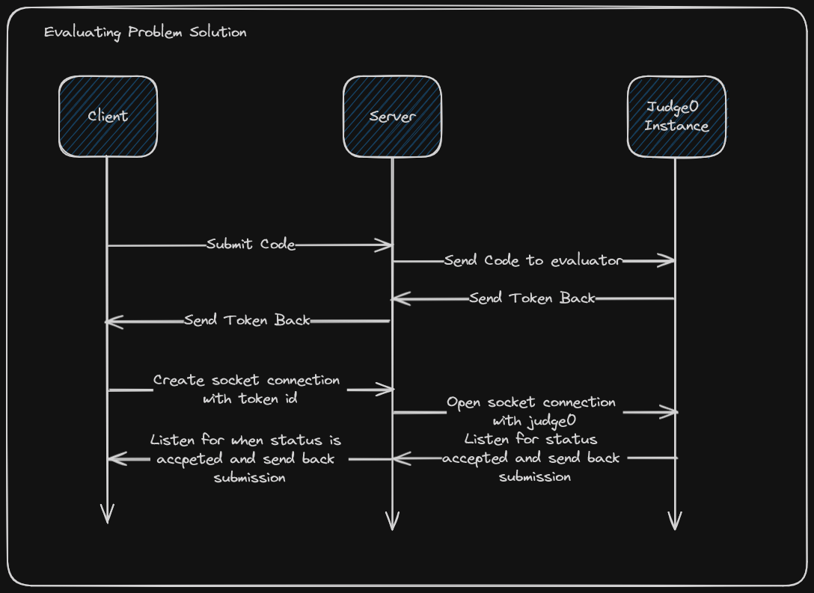

# 3. Evaluator Solution

Date: 2024-02-08

## Status

Accepted

## Context

We need the ability to evaluate users code. We've decided to use Judge0 Instance to handle the code evaluation to prevent all the overhead of code evaluation.

### Sequence Diagram

