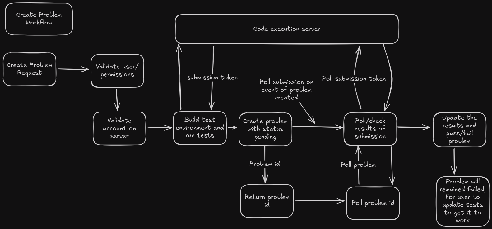

## Problem Domain: Create Problem Workflow

The **Create Problem Workflow** defines the series of steps required to create a new coding problem within the competitive coding platform. This process ensures that problems are created securely, verified for correctness, and properly tested before being added to the system.

### Workflow Steps:

1. **Validate User Permissions**

   - The system checks if the user has the necessary permissions to create a problem. Users must have the appropriate role, such as an admin or problem-setter, to proceed.

2. **Auth Server Validation**

   - The user's credentials are validated with the authentication server to ensure the user is properly authenticated. If authentication fails, the workflow terminates, and the problem is not created.

3. **Server Account Verification**

   - The system verifies that the user's account exists and is valid on the server. This check ensures that the user has an active and approved account for problem creation.

4. **Create Test Environment**

   - Once user validation is successful, the system creates a test environment to evaluate the problem's test cases. This environment is isolated to prevent interference with other system processes.

5. **Run Tests**

   - The problem's test cases are executed in the test environment. The system ensures the correctness of the problem through predefined tests. If any test fails, the problem creation process is halted.

6. **Create Problem**
   - If all tests pass successfully, the system finalizes the problem creation process. The new problem is added to the problem pool, and it becomes available for use in the competitive coding environment.

### Important Notes:

- Any failure in permission validation, authentication, or testing will result in the termination of the workflow.
- Problems that fail the tests must be revised and re-submitted for validation.
